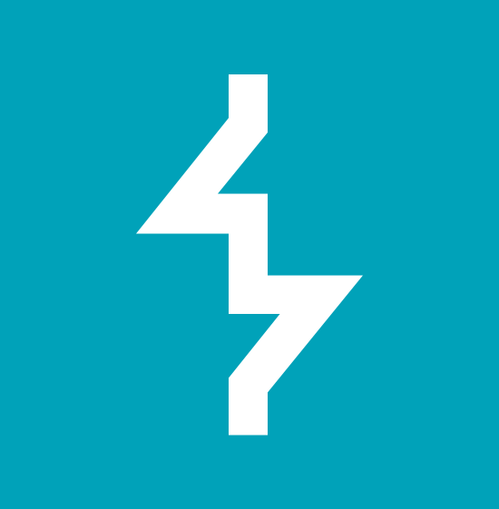

```
┌─[matin@github]─[~]
└──╼ $ neofetch

  ███╗   ███╗ █████╗ ████████╗██╗███╗   ██╗   matin@github
  ████╗ ████║██╔══██╗╚══██╔══╝██║████╗  ██║   ────────────────────────────
  ██╔████╔██║███████║   ██║   ██║██╔██╗ ██║   edu       CS @ TUM
  ██║╚██╔╝██║██╔══██║   ██║   ██║██║╚██╗██║   focus     offsec · systems · low-level
  ██║ ╚═╝ ██║██║  ██║   ██║   ██║██║ ╚████║   langs     C · C++ · Python
                                              mail      gholami.matin@gmail.com
                                              LinkedIn  matin-gholami
```
## `$ ./toolbox`

<p>
  &nbsp;&nbsp;&nbsp;
  &nbsp;&nbsp;&nbsp;
  &nbsp;&nbsp;&nbsp;
  &nbsp;&nbsp;&nbsp;
  &nbsp;&nbsp;&nbsp;
  &nbsp;&nbsp;&nbsp;
  &nbsp;&nbsp;&nbsp;
  &nbsp;&nbsp;&nbsp;
  &nbsp;&nbsp;&nbsp;
  &nbsp;&nbsp;&nbsp;
  
</p>
